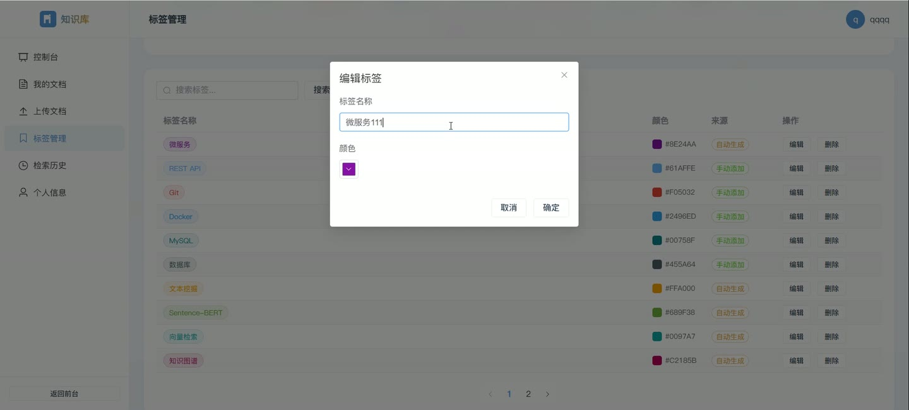
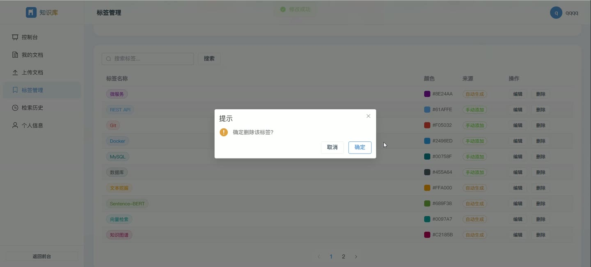
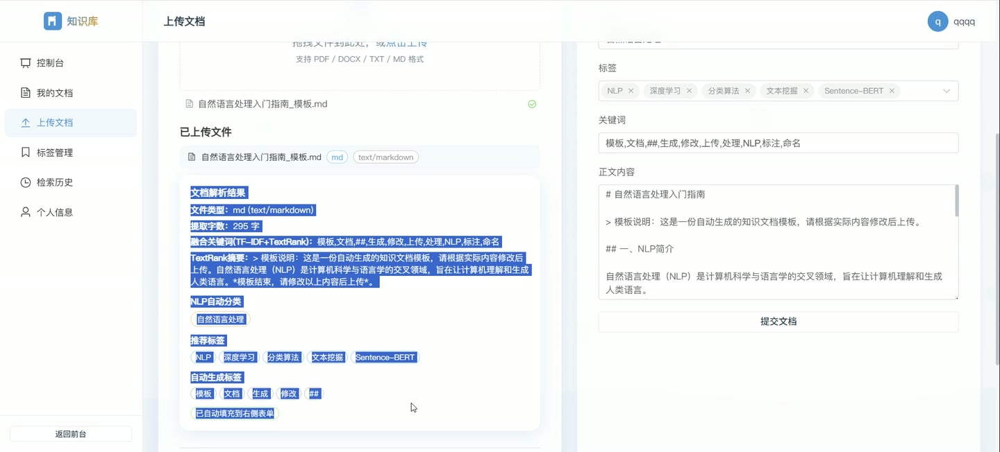
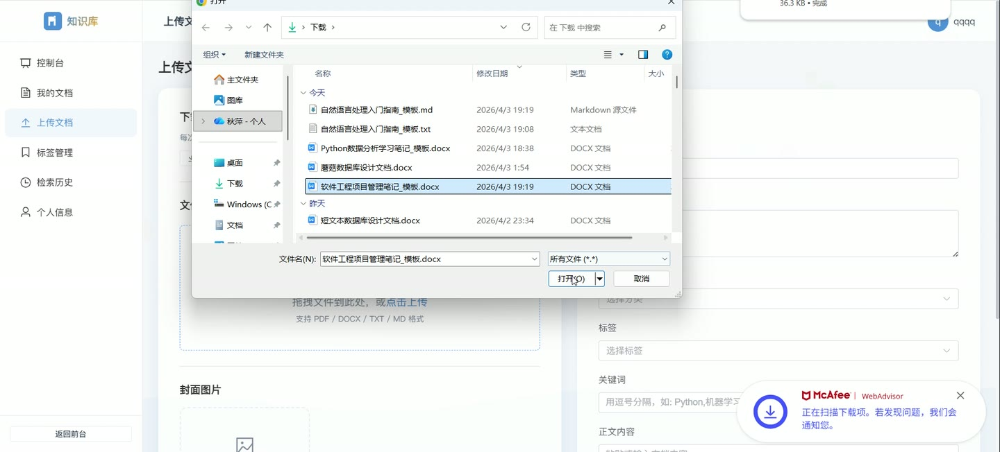
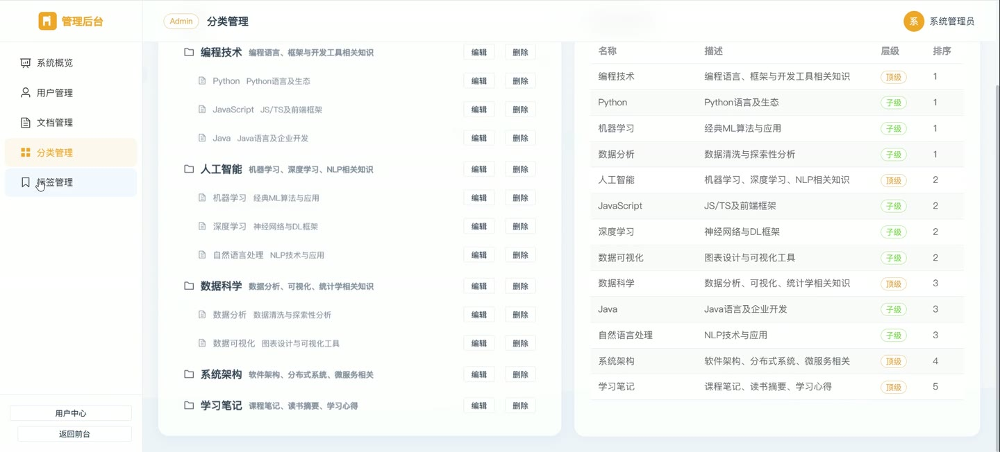

# (附文档)Python+FastAPI+Vue3 个人知识库自动化分类与检索系统

**技术栈**：Python、FastAPI、深度学习、Vue3、MySQL

### 系统简介

本系统是一套基于 Python + FastAPI + Vue3 的个人知识库自动化分类与检索平台，采用前后端分离架构。系统面向普通用户与管理员两类角色，提供文档上传、NLP 自动分类、语义向量检索、标签云可视化等能力，覆盖知识文档从入库、归类、检索到统计分析的完整链路。
 
### 核心功能
 
### 普通用户端

 
- 账号注册：填写用户名、昵称、邮箱、密码完成注册，注册后跳转登录页。 
- 账号登录：输入用户名与密码登录，登录成功后按角色跳转至用户控制台或管理后台。 
- 个人控制台：展示我的文档数、检索次数、总浏览量三项统计卡片。 
- 最新文档列表：在控制台查看最近上传的文档标题与创建日期，点击进入详情。 
- 热门标签展示：在控制台查看文档数靠前的标签及其数量。 
- 文档上传：填写标题、正文内容、摘要、分类、关键词、封面图并关联标签后提交入库。 
- 我的文档管理：查看本人已上传的文档列表，支持编辑与删除操作。 
- 标签管理：查看本人相关标签，支持按名称搜索标签。 
- 检索历史：查看本人历史检索记录，含查询词、结果数量与检索时间。 
- 个人资料维护：修改昵称、邮箱、头像等个人信息。 
- 文档库浏览：按关键词与分类筛选已发布文档，分页浏览文档卡片。 
- 文档详情查看：展示标题、作者、分类、浏览量、标签、关键词、摘要、正文与原始文件下载入口。 
- 关键词检索：输入自然语言查询词，按分页返回匹配文档列表。 
- 语义向量检索：切换至 Sentence-BERT 语义模式，按相似度百分比返回 TopK 结果。 
- 标签云浏览：以字号大小反映文档数量，点击标签跳转至对应文档列表。
 
### 管理员端

 
- 系统概览：展示用户数、文档数、标签数、分类数、检索次数五项统计卡片。 
- 分类文档分布图：以环形饼图展示各分类下的文档数量占比。 
- 热门文档 TOP5：按浏览量排序展示最受关注的文档及浏览次数。 
- 最新文档列表：分页展示最近创建的文档标题、摘要、浏览量、创建时间。 
- 用户管理：分页查看用户列表，支持按用户名或昵称搜索。 
- 用户编辑：修改用户昵称、邮箱与角色（管理员/普通用户）。 
- 用户状态控制：一键启用或禁用指定用户账号。 
- 用户删除：删除指定用户账号。 
- 文档管理：分页查看全站文档，支持按关键词与分类筛选。 
- 文档删除：删除任意违规或无效文档。 
- 分类管理：以树形结构展示顶级分类与子分类，支持新增、编辑、删除分类。 
- 分类字段维护：设置分类名称、描述、父分类与排序值。 
- 标签管理：分页查看全站标签，支持按名称搜索。 
- 标签编辑：修改标签名称与颜色，区分自动生成与手动添加来源。 
- 标签删除：删除指定标签。
 
### 技术栈

 后端框架Python + FastAPI ORMSQLAlchemy 数据校验Pydantic 权限控制JWT Token + 路由角色守卫（admin/user） 深度学习/NLPTF-IDF、TextRank 关键词提取、Sentence-BERT 语义向量 前端框架Vue3 状态管理Pinia 路由Vue Router UI 组件库Element Plus 图表库ECharts 构建工具Vite 数据库MySQL
 
### 交付内容

 
- 后端完整源码 
- 前端完整源码 
- 数据库初始化脚本 
- 万字文档

## 界面展示

---

## 获取完整源码 + 万字文档

本仓库为项目介绍页。**完整前后端源码、数据库初始化脚本、万字项目文档**，请加微信 `kangkangcode`，或访问 [codekk.top](http://codekk.top) 获取。

可作课程设计 / 毕业设计参考，支持远程部署调试。